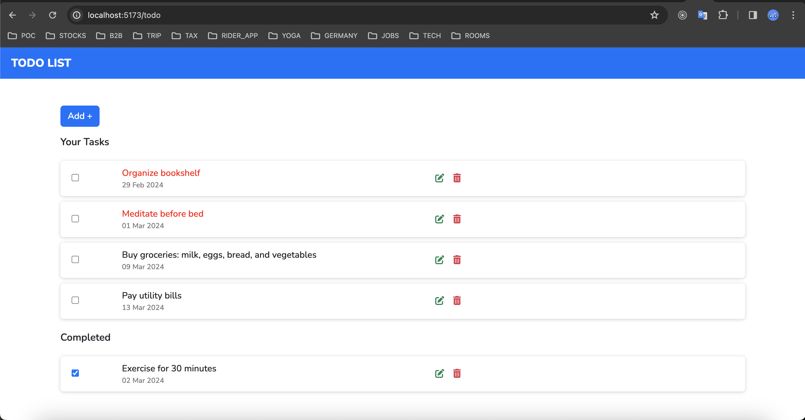

# TODO APP (Version 1.0)

A TODO Application, Using React . Typescript . Vite . Jest . Axios

This React application, created with TypeScript, allows users to manage todo operations. It connects to an API service using HTTP calls, showcasing a straightforward and efficient architecture.

## Table of Contents

- [Getting Started](#getting-started)
  - [Installation](#installation)
  - [Packages](#packages)
  - [Running the Application](#running-the-application)
- [Folder Structure](#folder-structure)
- [UI UX](#ui-ux)

## Getting Started

A react application for basic Todo operations and connecting to http request

### Installation

#### Clone the repository:

Open your terminal or command prompt, go to the desired directory, and use the following command to clone the react project:

```
git clone https://github.com/maheshpeechamkoli/vp-todo-apps.git
cd vp-todo-apps
```

### Running the Application

#### Running the Application using Docker

```
docker-compose build (Docker Compose V1)
docker compose build (Docker Compose V2)

docker-compose up (Docker Compose V1)
docker compose up (Docker Compose V2)

```

Or

```
docker build -t todo-docker-image .
docker images | grep todo-docker-image
docker run -p 5173:5173 todo-docker-image
```

#### Running the Application using Node CLI

Downlaod Node and Install

Use node (v18). "nvm" for better version management of node

```
https://nodejs.org/en
```

```
npm install
```

##### Add .env file in root directory and add the following

```
VITE_BASE_URL={{host}}/api/v1.0
```

Run the app

```
npm run dev
```

#### Run Unit Test project

```
npm test
```

NOTE:

```
Make sure your Api service are up and running. If not please have a look
https://github.com/maheshpeechamkoli/vp-todo-api-services.git
```

### Packages

#### Project - version details

"@fortawesome/fontawesome-free": "^6.5.1",
"bootstrap": "^5.3.2",
"react": "^18.2.0",
"react-dom": "^18.2.0",
"react-router-dom": "^6.21.2",
"react-toastify": "^9.1.3",
"vite-plugin-environment": "^1.1.3"

## Folder Structure

```
  /src
  |-- /__tests__
  |-- /assets
  |   |-- /images
  |-- /components
  |   |-- /navbar
  |       |-- Navbar.tsx
  |   |-- /todo
  |       |-- /css
  |           |-- List.css
    |         |-- Todo.css
  |       |-- Add.tsx
  |       |-- List.tsx
  |       |-- TodoForm.tsx
  |       |-- Update.tsx
  |-- /services
  |   |-- todo-service.ts
  |-- /interface
  |   |-- todo.ts
  |-- /test
  |   |-- /_ _mocks__
  |       |-- fileMock.js
  |       |-- styleMock.ts
  |-- App.tsx
  |-- main.tsx
|-- jest.config.ts
|-- .gitignore
|-- package.json
|-- .env
|-- README.md
```

## UI UX



### Add UI


### Update


### THANK YOU SO MUCH
